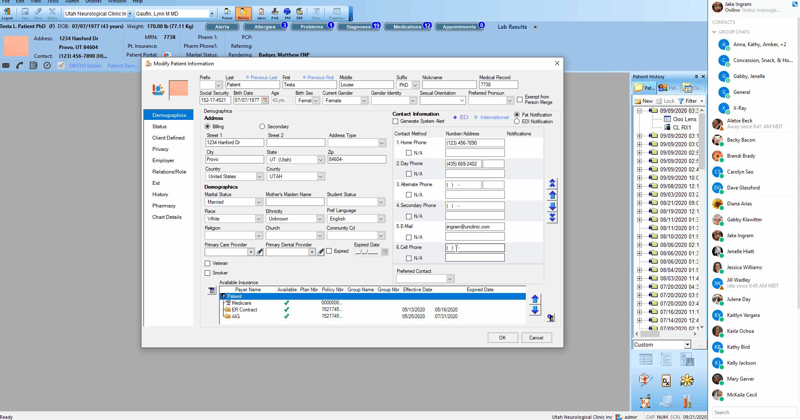

# Enable Text Message Reminders

These instructions describe how to enable text message reminders for patients in their demographics.

## Enabling

1. Open patient demographics window.
2. Ensure a cell phone number is provided.
3. Click on the purple 'EDI' button
4. Ensure 'SMS' is selected, and 'Voice Reminders' is deselected. 
5. Click 'OK'
6. Save & Close

*Note: Without a cell phone number, text message reminders will not be sent.*

