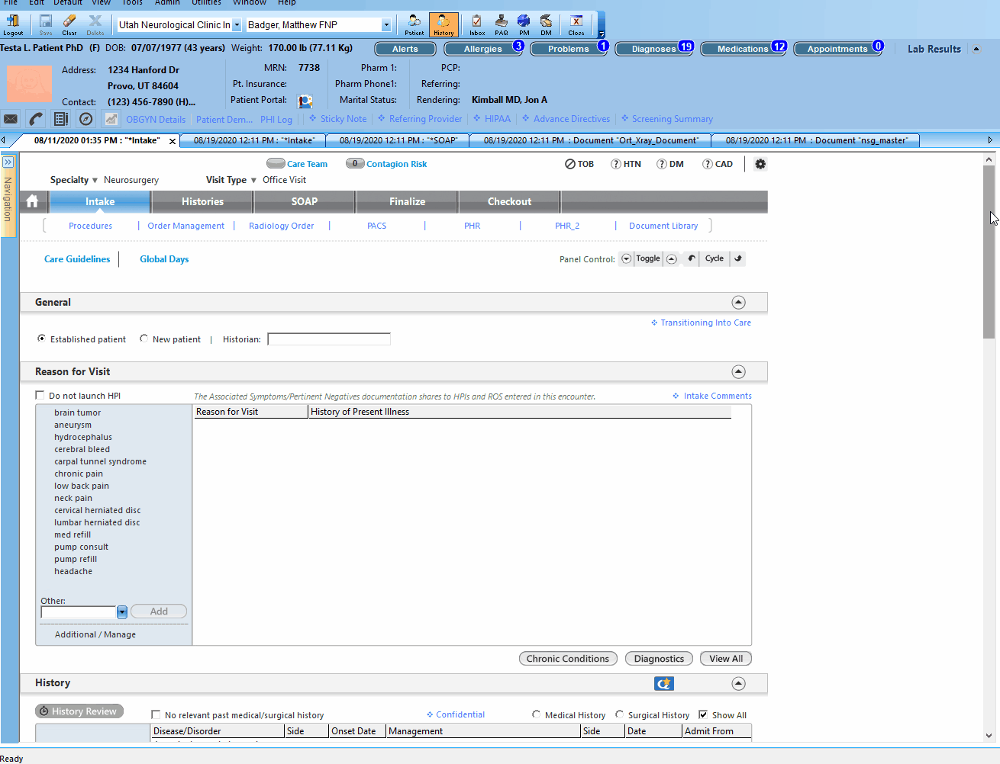
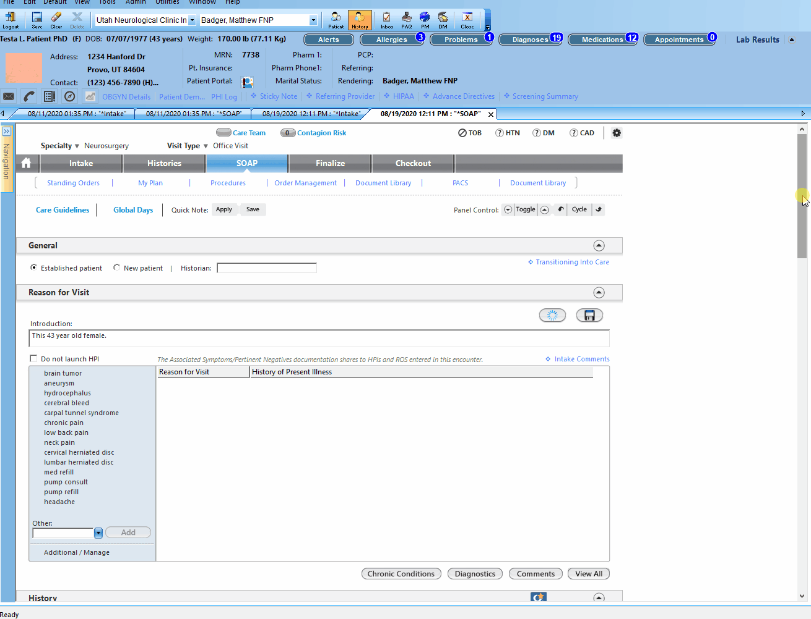

# Physician Xray Dictations

These instructions describe how to add physician dictations to completed xray orders.

## Adding dictations

1. Open patient chart to 'Intake'
2. Scroll down to the 'Orders' box
3. Select the desired order (will generally say 'order recieved') and click 'edit'
4. In the 'Orders edit' pop-up, navigate to the 'Result/report' section and check off 'received'.
5. Enter the physician dictations in the box titled 'Result Details'
6. Save & Close

## Generating documents

1. Open patient chart to 'SOAP'
2. Scroll to the bottom and click 'Generate Note'
3. Select 'ngs_master' and click 'OK'
4. Repeat and generate 'X-ray note'

Dictations will now appear in both 'ngs_master' and 'Ort_Xray_Document'
