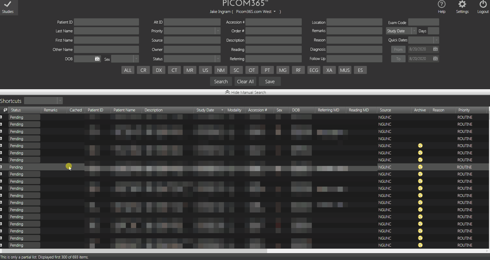
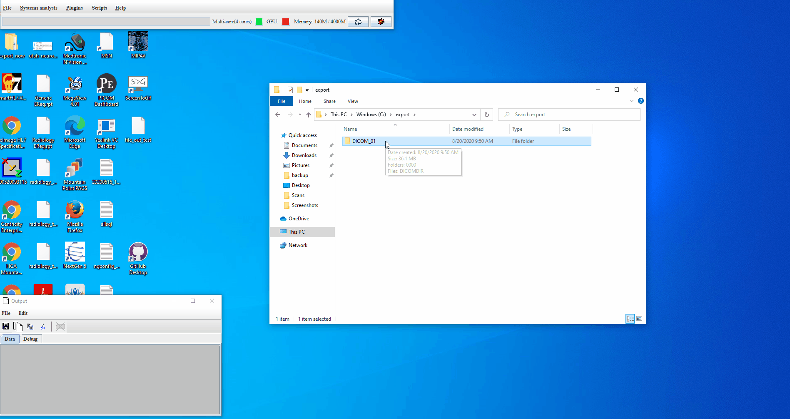
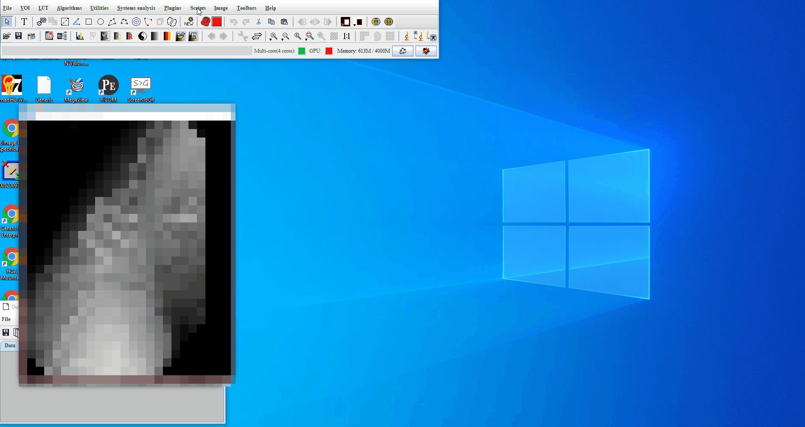
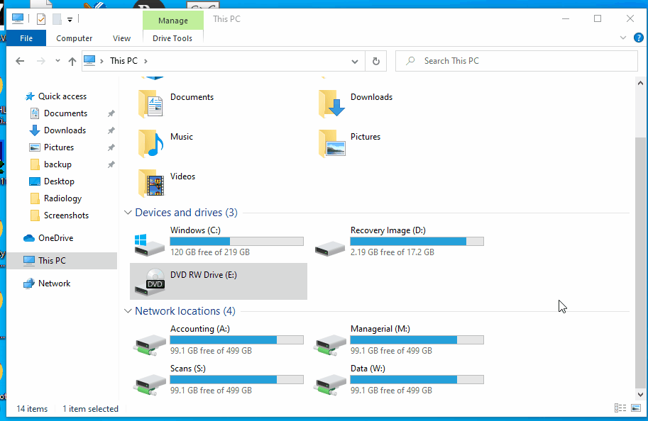
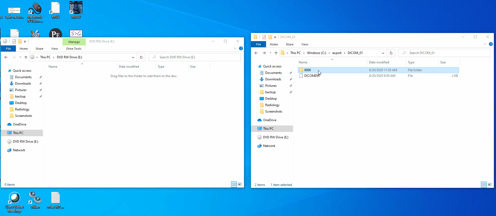

# Saving files from PICOM Dashboard

These instructions explain how to export images from Picom365 and convert to a usable format for patients

## Getting started

- Ensure that PICOM Dashboard is installed on your PC. If it is not, login to [picom365.com](https://picom365.com) using your credentials and download the client.

- Ensure MIPAV is install on your PC. If it is not, [click here for the installer page.](https://mipav.cit.nih.gov/download.php)
  - Download the [MIPAV batch script](image_batch.sct).

### Step 1: Extract files from PICOM Dashboard client

1. Open PICOM Dashboard
2. Click on the 'Studies' tab
3. Right click on the patient to be saved
4. Click 'PICOM/DICOM Media Export'
5. Under 'Export Options', click 'DICOM Media Export'
6. Click 'Save'
7. Save the file on your desktop to a dedicated folder. *Note: If you are not using Jenelle's workstation, you will likely need to save the file directly to your C drive (not remote drive). Jenelle's workstation has special privileges*

### Step 2: Convert files to DICOM format

1. Open MIPAV
2. Drag the folder titled '0000' into the top MIPAV window

3. From the top menu bar, click Scripts > Run Script > image_batch.sct > Open
4. All imported images will appear in the 'Images' box. Select all images (hold shift to select multiple files) and drag & drop on '$image1 (SaveImageAs -- input_image_1)'
5. Click 'Run Script'

All images are now converted to DICOM format and will appear inside the original folder.

## Transferring files to patient

*Use these instructions after you have converted the images to DICOM format*

- These instructions are optimized to work with DVD-RW disks (available across the street at Target)

### Saving to a disk

1. Insert a blank disk into the disk drive
2. Open File Explorer and click 'This PC'
3. Wait for the 'DVD RW Drive' to change icons to DVD-RW 4.38 GB free of 4.38 GB
4. Double click the DVD-RW icon
5. When prompted 'How do you want to use this disk?', select 'With a CD/DVD player'

6. Drag the folder titled '0000' into the disk folder. Wait a moment for the disk folder to refresh
7. Once the file appears inside the disk folder, right click and click 'Burn to disk'
8. Title the disk accordingly (patient name) and click 'next'. *Note: The disk burning process may take 2-3 minutes to complete*
10. Click 'finish'

### Saving to a USB

Simply drag the folder titled '0000' to a USB.

### Emailing to a patient

The files will need to be compressed to email. 
